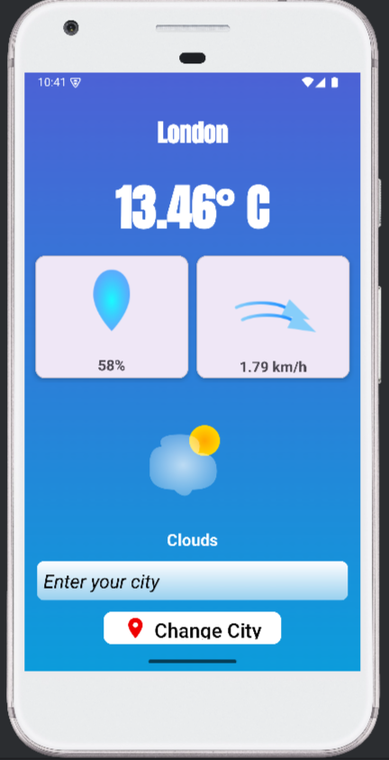
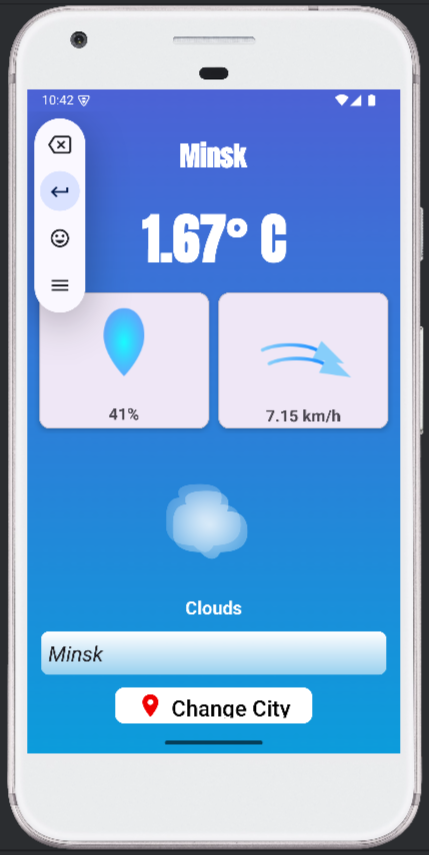
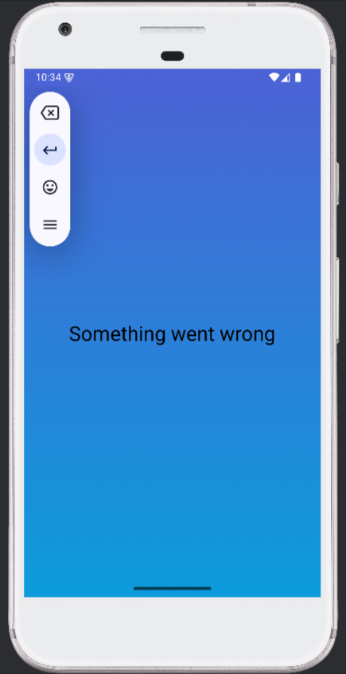

# Weather Forecast App

A simple Android application that displays current weather data by city.  

## Features

- Display temperature, humidity, wind speed, and weather condition
- Search weather by city name
- Modern UI using Material Design
- Basic error handling for API failures

## Screenshots

| London | Minsk | Error |
|--------|-------|-------|
|  |  |  |

## Tech Stack

- Kotlin
- Coroutines
- View Binding
- Material Components
- OpenWeatherMap API

